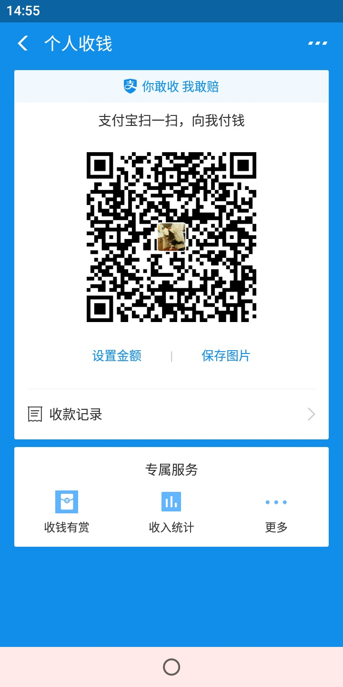

# tree-transfer

> A Vue.js project

## Build Setup

```bash
# install dependencies
npm install

# serve with hot reload at localhost:8080
npm run dev

# build for production with minification
npm run build

# build for production and view the bundle analyzer report
npm run build --report

# run unit tests
npm run unit

# run e2e tests
npm run e2e

# run all tests
npm test
```

# el-tree-transfer

## 简介

---

el-tree-fransfer 是一个基于 VUE 和 element-ui 的树形穿梭框组件，使用前请确认已经引入[element-ui](http://element.eleme.io/#/zh-CN/component/quickstart)！
此组件功能类似于`element-ui`的[transfer](http://element.eleme.io/#/zh-CN/component/transfer)组件，但是里面的数据是树形结构！
实际上，el-tree-transfer 依赖的 element-ui 组件分别是[Checkbox 多选框](http://element.eleme.io/#/zh-CN/component/checkbox#checkbox-duo-xuan-kuang)，[Button 按钮](http://element.eleme.io/#/zh-CN/component/button)，和最主要的[Tree 树形控件](http://element.eleme.io/#/zh-CN/component/tree)写成！并非是在 element-ui 的穿梭框组件上的扩展，而仅仅是参照了其外观样式和功能。

因为公司业务使用 vue 框架，ui 库使用的 element-ui。在市面上找到一个好用的 vue 树形穿梭框组件都很难，又不想仅仅因为一个穿梭框在 element-ui 之外引入其他重量级插件，因此就有了 el-tree-transfer。轻量，易用，无需投入其他学习成本。

### [在线访问](http://tree-transfer.zhongxiang.shop/) - [GitHub](https://github.com/hql7/tree-transfer) - [NPM](https://www.npmjs.com/package/el-tree-transfer) - [SegmentFault](https://segmentfault.com/a/1190000015553081) - [CSDN](https://blog.csdn.net/qq_15390381/article/details/80943549)- [掘金](https://juejin.im/post/5b3ecae8e51d4519213fae4b)

#### 注意！ 1.9.0 版本增强id为数字型的匹配强度，1.9.7版本增加`defaultTransfer`属性用来满足用户不想将数据拆分成fromData和toData的需求

#### 注意！ 1.8.9 版本修复一个节点既是一侧的枝干节点又是另一侧的叶子节点时穿梭引起的重复错误！解决自定义节点名时筛选无效错误

#### 注意！ 1.8.7 版本增加通讯录模式，可通过 mode 字段配置模式

#### 注意！ 1.7.7 版本移动事件参数调整，直接返回移动后的 fromData 数据和 toData 数据。

#### 注意！ 1.5 以上版本改为自动处理

> 第一层数据的 pid 请设定为 0！！

> id 推荐为 string，但也可以是 number，请不要混用，id 不要重复！！！

## 快速上手

> 先 npm 下载插件

`npm install el-tree-transfer --save`

或

`npm i el-tree-transfer -S`

> 然后你可以像使用普通组件一样使用 el-tree-transfer

    <template>
      <div>
        // 你的代码
        ...
        // 使用树形穿梭框组件
        <tree-transfer :title="title" :from_data='fromData' :to_data='toData' :defaultProps="{label:'label'}" @addBtn='add' @removeBtn='remove' :mode='mode' height='540px' filter openAll>
        </tree-transfer>
      </div>
    </template>

    <script>
      import treeTransfer from 'el-tree-transfer' // 引入

      export defult {
        data(){
          return:{
            mode: "transfer", // transfer addressList
            fromData:[
              {
                id: "1",
                pid: 0,
                label: "一级 1",
                children: [
                  {
                    id: "1-1",
                    pid: "1",
                    label: "二级 1-1",
                    children: []
                  },
                  {
                    id: "1-2",
                    pid: "1",
                    label: "二级 1-2",
                    children: [
                      {
                        id: "1-2-1",
                        pid: "1-2",
                        children: [],
                        label: "二级 1-2-1"
                      },
                      {
                        id: "1-2-2",
                        pid: "1-2",
                        children: [],
                        label: "二级 1-2-2"
                      }
                    ]
                  }
                ]
              },
            ],
            toData:[]
          }
        },
        methods:{
          // 切换模式 现有树形穿梭框模式transfer 和通讯录模式addressList
          changeMode() {
            if (this.mode == "transfer") {
              this.mode = "addressList";
            } else {
              this.mode = "transfer";
            }
          },
          // 监听穿梭框组件添加
          add(fromData,toData,obj){
            // 树形穿梭框模式transfer时，返回参数为左侧树移动后数据、右侧树移动后数据、移动的{keys,nodes,halfKeys,halfNodes}对象
            // 通讯录模式addressList时，返回参数为右侧收件人列表、右侧抄送人列表、右侧密送人列表
            console.log("fromData:", fromData);
            console.log("toData:", toData);
            console.log("obj:", obj);
          },
          // 监听穿梭框组件移除
          remove(fromData,toData,obj){
            // 树形穿梭框模式transfer时，返回参数为左侧树移动后数据、右侧树移动后数据、移动的{keys,nodes,halfKeys,halfNodes}对象
            // 通讯录模式addressList时，返回参数为右侧收件人列表、右侧抄送人列表、右侧密送人列表
            console.log("fromData:", fromData);
            console.log("toData:", toData);
            console.log("obj:", obj);
          }
        },
        comporents:{ treeTransfer } // 注册
      }
    </script>

    <style>
    ...
    </style>

## 文档

1.  参数：`width` 说明：`宽度` 类型：`String` 必填：`false` 默认：`100%` 补充：`建议在外部盒子设定宽度和位置`

2.  参数：`height` 说明：`高度` 类型：`String` 必填：`false` 默认：`320px`

3.  参数：`title` 说明：`标题` 类型：`Array` 必填：`false` 默认：`["源列表", "目标列表"]`

4.  参数：`button_text` 说明：`按钮名字` 类型：`Array` 必填：`false` 默认：`空`

5.  参数：`from_data` 说明：`源数据` 类型：`Array` 必填：`true` 补充：`数据格式同element-ui tree组件，但必须有id和pid`

6.  参数：`to_data` 说明：`目标数据` 类型：`Array` 必填：`true` 补充：`数据格式同element-ui tree组件，但必须有id和pid`

7.  参数：`defaultProps` 说明：`配置项-同el-tree中props` 必填： `false` 补充：`用法和el-tree的props一样`

8.  参数：`node_key` 说明：`自定义node-key的值，默认为id` 必填：`false` 补充：`必须与treedata数据内的id参数名一致，必须唯一`

9.  参数：`pid` 说明：`自定义pid的参数名，默认为"pid"` 必填：`false` 补充：`有网友提出后台给的字段名不叫pid，因此增加自定义支持`

10. -- 不建议使用！参数：`leafOnly` 说明：`是否只返回叶子节点` 类型：`Boolean` 必填：`false` 补充：`默认false，如果你只需要返回的末端子节点可使用此参数`

11. 参数：`filter` 说明：`是否开启筛选功能` 类型：`Boolean` 必填：`false`

12. 参数：`openAll` 说明：`是否默认展开全部` 类型：`Boolean` 必填：`false`

13. 参数：`renderContent` 说明：`自定义树节点` 类型：`Function` 必填：`false` 补充：`用法同element-ui tree`

14. 参数：`mode` 说明：`设置模式，字段可选值为transfer|addressList` 类型：`String` 必填：`false` 补充：`mode默认为transfer模式，即树形穿梭框模式，可配置字段为addressList改为通讯录模式，通讯录模式时按钮不可自定义名字，如要自定义标题名在title数组传入四个值即可，addressList模式时标题默认为通讯录、收件人、抄送人、密送人`

15. 参数：`transferOpenNode` 说明：`穿梭后是否展开穿梭的节点` 类型：`Boolean` 必填：`false` 补充：`默认为true即展开穿梭的节点，便于视觉查看，增加此参数是因为数据量大时展开会有明显卡顿问题，但注意，如此参数设置为false则穿梭后不展开，毕竟无法确定第几层就会有庞大数据`

16. 参数：`defaultCheckedKeys` 说明：`默认选中节点` 类型：`Array` 必填：`false` 补充：`只匹配初始时默认节点，不会在你操作后动态改变默认节点`

17. 参数：`placeholder` 说明：`设置搜索框提示语` 类型：`String` 必填：`false` 补充：`默认为请输入关键词进行筛选`

18. 参数：`defaultTransfer` 说明：`是否自动穿梭一次默认选中defaultCheckedKeys的节点` 类型：`Boolean` 必填：`false` 补充：`默认false，用来满足用户不想将数据拆分成fromData和toData的需求`

19. 事件：`addBtn` 说明：`点击添加按钮时触发的事件` 回调参数：`function(fromData,toData,obj),树形穿梭框transfer模式分别为1.移动后左侧数据，2.移动后右侧数据，3.移动的节点keys、nodes、halfKeys、halfNodes对象；通讯录addressList模式时返回参数为右侧收件人列表、右侧抄送人列表、右侧密送人列表`

20. 事件：`removeBtn` 说明：`点击移除按钮时触发的事件` 回调参数：`function(fromData,toData,obj),树形穿梭框transfer模式分别为1.移动后左侧数据，2.移动后右侧数据，3.移动的节点keys、nodes、halfKeys、halfNodes对象；通讯录addressList模式时返回参数为右侧收件人列表、右侧抄送人列表、右侧密送人列表`

## 版本说明

> 1.9.7 版本增加`defaultTransfer`属性用来满足用户不想将数据拆分成fromData和toData的需求，增加`placeholder`属性。

> 1.9.0 增强 id 既有数字又有字符型时的正则匹配强度。

> 1.8.9 版本修复一个节点既是一侧的枝干节点又是另一侧的叶子节点时穿梭引起的重复错误！解决自定义节点名时筛选无效错误。

> 1.8.8 版本增加`transferOpenNode`参数用来管理穿梭后是否展开节点，`defaultCheckedKeys`用来设置初始时默认展开节点。

> 1.8.7 版本增加通讯录模式，可通过 mode 字段配置模式，mode 字段可选值为`transfer`|`addressList`。

> 1.7.7 版本 `addBtn` 和 `removeBtn` 事件参数调整，返回三个参数，第一个参数是移动后的 fromData 数据，第二个参数是移动后的 toData 数据，第三个参数是{keys, nodes, harfKeys, harfNodes}对象。增加 `renderContent` 参数支持树节点自定义。

> 1.6.7 版本增加`filter,openAll`参数，来设置是否开启筛选和是否默认展开全部

> 1.5.9 版本增加`leafOnly`参数，来设置是否只返回树的末端叶子节点

> 1.5.8 版本恢复上个版本莫名删掉的返回`nodes`的代码，如果您的项目只需要穿梭的 node-key 值则无需更新！道歉 ing。。。

> 1.5.7 版本修复子组件异步数据有时不会更新的问题！修复了自定义参数名 node_key,children 时的一个错误，自动把第一层数据的 pid 替换为 0

> 1.4.9 版本增加了添加和移除按钮的回调参数，function(keys,nodes)第一个参数为选中节点 node-key 值，第二个参数为选中节点 node

> 1.4.8 版本修复了 id 为 number 类型时无法通过重复校验函数的问题，但仍然推荐 id 使用 string 型

> 1.4.7 版本增加了`defaultProps`参数，`node_key`参数，`pid`参数，主要作用为可以自定义一些重要字段名，来提高数据灵活性，避免和后台因为字段名不同而被祭天

> 1.3.7 版本取消了对 loadsh 库的依赖，此前仅用此库做某些深拷贝处理

## [GitHub demo 代码地址](https://github.com/hql7/tree-transfer) 欢迎 star 谢谢

## 有好多有脾气的老哥找我给打赏，谢过



